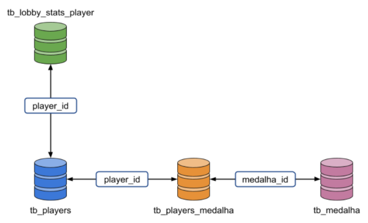

# **Gamers Club**

## **Case - Data Analyst | Lucas R. Schiavetti | Feb, 22**

### *Context*

* the main goal of this case is explore CS-GO data within Gamers Clube business context; 
* the available database has 4 tables (players, lobby-players, medals and medal-players) 
  * keys are **player_id** and **medal_id**;
* this notebook has complimentary analysis to the case, mainly with basic statistics, some exploratory data anylisis and some plots.

